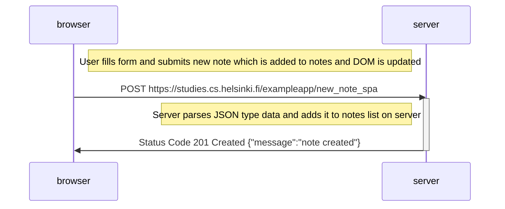

```mermaid
sequenceDiagram
        participant browser
        participant server

        Note right of browser : User fills form and submits new note which is added to notes and DOM is updated

        browser->>server : POST https://studies.cs.helsinki.fi/exampleapp/new_note_spa
        activate server
        Note left of server : Server parses JSON type data and adds it to notes list on server
        server->>browser : Status Code 201 Created {"message":"note created"}
        deactivate server

        


```