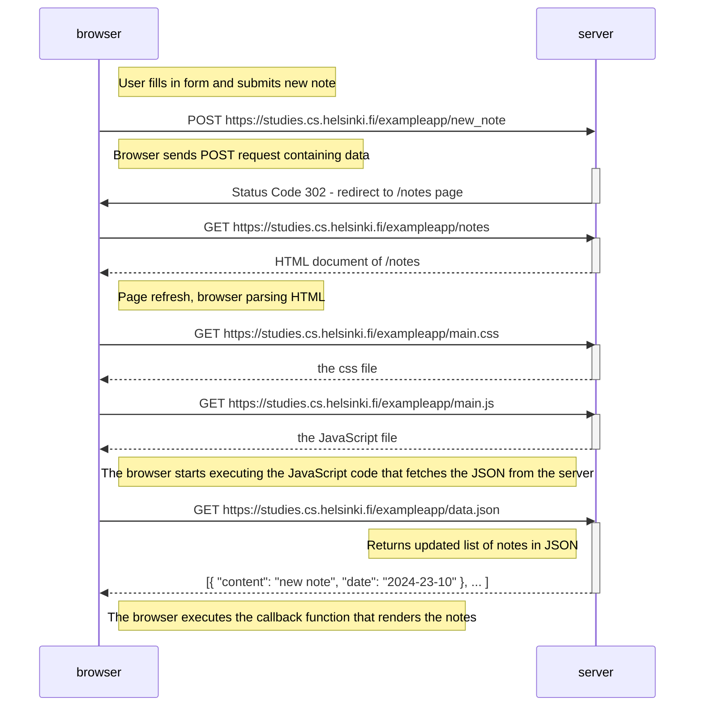

```mermaid
sequenceDiagram
        participant browser
        participant server


        Note right of browser : User fills in form and submits new note

        browser->>server : POST https://studies.cs.helsinki.fi/exampleapp/new_note
        Note right of browser : Browser sends POST request containing data
        activate server
        server->>browser : Status Code 302 - redirect to /notes page
        deactivate server

         browser->>server: GET https://studies.cs.helsinki.fi/exampleapp/notes
        activate server
        server-->>browser: HTML document of /notes
        deactivate server

        Note right of browser : Page refresh, browser parsing HTML

        browser->>server: GET https://studies.cs.helsinki.fi/exampleapp/main.css
        activate server
        server-->>browser: the css file
        deactivate server

        browser->>server: GET https://studies.cs.helsinki.fi/exampleapp/main.js
        activate server
        server-->>browser: the JavaScript file
        deactivate server


        Note right of browser: The browser starts executing the JavaScript code that fetches the JSON from the server

        browser->>server: GET https://studies.cs.helsinki.fi/exampleapp/data.json
        activate server
        Note left of server : Returns updated list of notes in JSON
        server-->>browser: [{ "content": "new note", "date": "2024-23-10" }, ... ]
        deactivate server

        Note right of browser: The browser executes the callback function that renders the notes

        


```