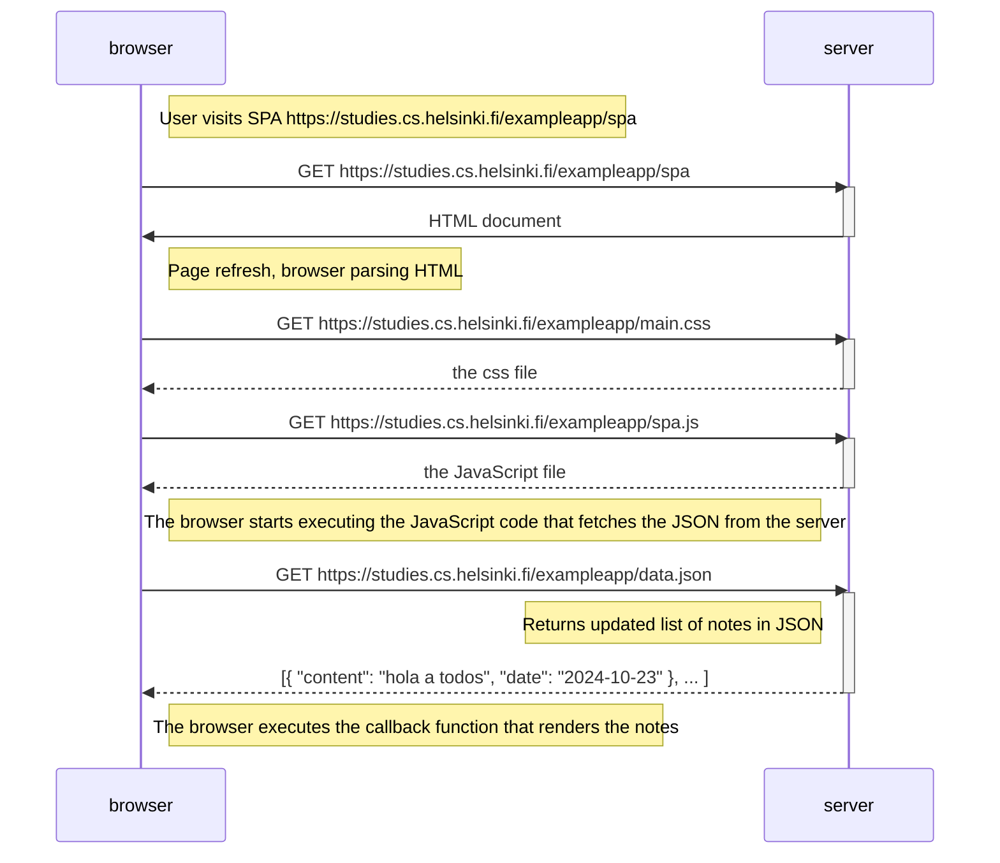

```mermaid

sequenceDiagram
            participant browser
            participant server

            Note right of browser : User visits SPA https://studies.cs.helsinki.fi/exampleapp/spa

            browser->>server : GET https://studies.cs.helsinki.fi/exampleapp/spa

            activate server
            server->>browser : HTML document
            deactivate server


            Note right of browser : Page refresh, browser parsing HTML

            browser->>server: GET https://studies.cs.helsinki.fi/exampleapp/main.css
            activate server
            server-->>browser: the css file
            deactivate server

            browser->>server: GET https://studies.cs.helsinki.fi/exampleapp/spa.js
            activate server
            server-->>browser: the JavaScript file
            deactivate server


            Note right of browser: The browser starts executing the JavaScript code that fetches the JSON from the server

            browser->>server: GET https://studies.cs.helsinki.fi/exampleapp/data.json
            activate server
            Note left of server : Returns updated list of notes in JSON
            server-->>browser: [{ "content": "hola a todos", "date": "2024-10-23" }, ... ]
            deactivate server

            Note right of browser: The browser executes the callback function that renders the notes

```

